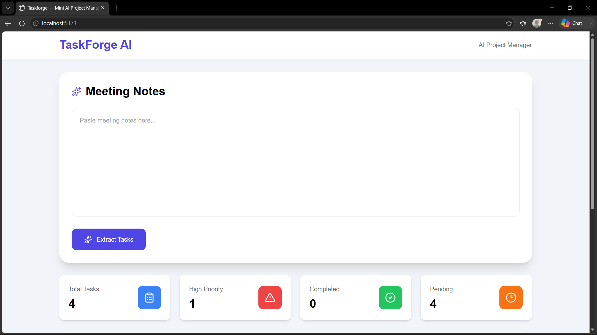
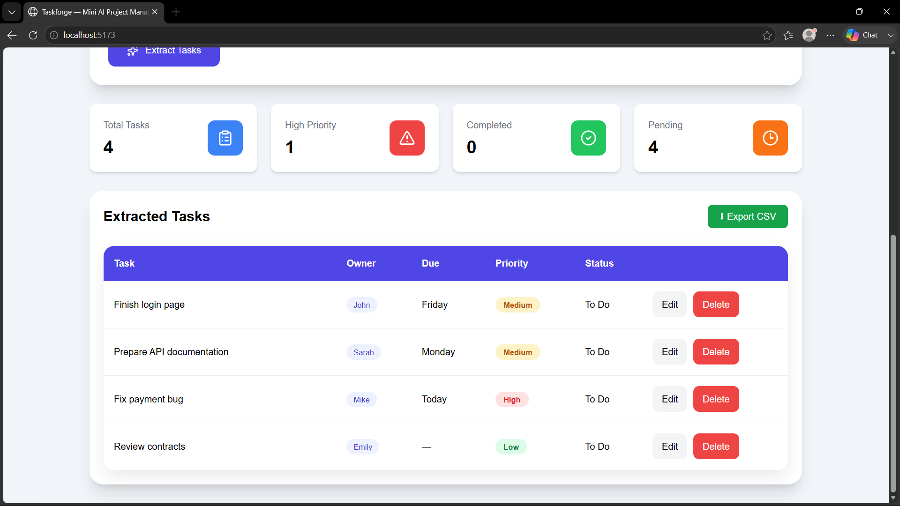

# 🚀 Mini AI Project Manager Assistant

An AI-powered Project Management Assistant that transforms unstructured meeting notes into structured, actionable tasks using a locally hosted Large Language Model (LLM).

This project demonstrates end-to-end full-stack AI application development using **FastAPI**, **React**, **SQLite**, and **Ollama (Qwen2.5:7B)**.

---

## ✨ Features

- 🤖 AI-powered task extraction from meeting notes
- 👤 Automatically identifies task owners
- 📅 Detects due days (Today, Tomorrow, Monday, Friday, etc.)
- 🔥 Assigns task priority (High / Medium / Low)
- 💾 Stores extracted tasks in SQLite
- ✏️ Edit task details
- 🗑️ Delete tasks
- 📊 Dashboard with task statistics
- 📄 Export tasks as CSV
- 🎨 Modern responsive React UI

---

## 🖼️ Preview

> Add screenshots here after pushing the project.

### Dashboard



### Extracted Tasks



---

## 🏗️ Project Architecture

```
Meeting Notes
      │
      ▼
React Frontend
      │
      ▼
FastAPI Backend
      │
      ▼
Ollama (Qwen2.5:7B)
      │
      ▼
Structured JSON Tasks
      │
      ▼
SQLite Database
      │
      ▼
Dashboard + Task Management
```

---

## 🛠️ Tech Stack

### Frontend

- React
- Vite
- Tailwind CSS
- Axios

### Backend

- FastAPI
- SQLAlchemy
- SQLite
- Pydantic

### AI

- Ollama
- Qwen2.5:7B

---

## 📂 Project Structure

```
mini-ai-project-manager-assistant/

│
├── backend/
│   ├── main.py
│   ├── models.py
│   ├── database.py
│   ├── schemas.py
│   ├── llm_extractor.py
│   └── requirements.txt
│
├── frontend/
│   ├── src/
│   ├── package.json
│   └── vite.config.js
│
├── README.md
└── .gitignore
```

---

## ⚙️ Installation

### 1. Clone Repository

```bash
git clone https://github.com/YOUR_USERNAME/mini-ai-project-manager-assistant.git

cd mini-ai-project-manager-assistant
```

---

### 2. Install Ollama

Download Ollama:

https://ollama.com/download

Pull the model:

```bash
ollama pull qwen2.5:7b
```

Start Ollama:

```bash
ollama run qwen2.5:7b
```

---

### 3. Backend Setup

```bash
cd backend

python -m venv venv

# Windows
venv\Scripts\activate

# macOS/Linux
source venv/bin/activate

pip install -r requirements.txt

uvicorn main:app --reload
```

Backend runs on:

```
http://127.0.0.1:8000
```

Swagger Docs:

```
http://127.0.0.1:8000/docs
```

---

### 4. Frontend Setup

```bash
cd frontend

npm install

npm run dev
```

Frontend runs on:

```
http://localhost:5173
```

---

## 📡 API Endpoints

| Method | Endpoint | Description |
|---------|----------|-------------|
| POST | `/extract` | Extract tasks using AI |
| GET | `/tasks` | Get all tasks |
| POST | `/tasks` | Create task |
| PUT | `/tasks/{id}` | Update task |
| DELETE | `/tasks/{id}` | Delete task |
| GET | `/tasks/export/csv` | Export tasks to CSV |

---

## 🎯 AI Capabilities

The assistant extracts:

- Task Description
- Task Owner
- Due Day
- Priority
- Structured JSON Output

Example:

Input:

```
John will finish the login page by Friday.
Sarah should prepare the API documentation before Monday.
Mike needs to fix the payment bug today.
```

Output:

```
✔ Finish login page
Owner: John
Due: Friday

✔ Prepare API documentation
Owner: Sarah
Due: Monday

✔ Fix payment bug
Owner: Mike
Due: Today
```

---

## 📈 Future Improvements

- Authentication
- User accounts
- Project workspaces
- Email reminders
- Kanban board
- Drag-and-drop tasks
- Calendar integration

---

## 👨‍💻 Author

**Parth Shah**

B.Tech Computer Engineering

AI / ML Enthusiast

GitHub:
https://github.com/YOUR_USERNAME

---

## 📄 License

Created for the **E2M Solutions Practical Assessment**.
